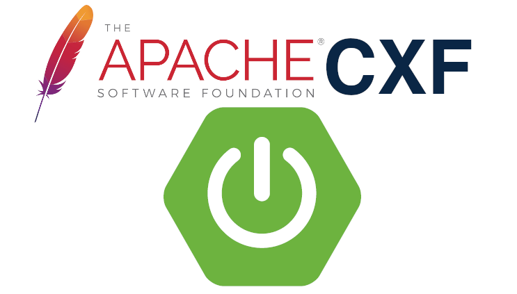

Enterprise & production ready SOAP webservices powered by Spring Boot & Apache CXF
======================================================================================
[](https://travis-ci.org/codecentric/cxf-spring-boot-starter)
[](https://maven-badges.herokuapp.com/maven-central/de.codecentric/cxf-spring-boot-starter/)
[](http://www.apache.org/licenses/LICENSE-2.0.html)
[](https://github.com/spring-projects/spring-boot)
[](https://www.oracle.com/technetwork/java/javase/downloads/index.html)
[](http://cxf.apache.org/)
[](https://spring.io/projects/spring-cloud-sleuth)
[](https://github.com/logstash/logstash-logback-encoder)
[](https://cxf-boot-simple.herokuapp.com/my-foo-api)



# Features include:

* __Generating all necessary Java-Classes__ using JAX-B from your WSDL/XSDs (using the complementing Maven plugin [cxf-spring-boot-starter-maven-plugin]
* Booting up Apache CXF within Spring Context with __100% pure Java-Configuration__
* __Complete automation of Endpoint initialization__ - no need to configure Apache CXF Endpoints, that´s all done for you automatically based upon the WSDL and the generated Java-Classes (bringing up a nice [Spring Boot 1.4.x Failure Message](http://docs.spring.io/spring-boot/docs/current/reference/html/boot-features-spring-application.html#_startup_failure) if you missed something :) )
* Customize SOAP service URL and the title of the CXF generated Service site
* __Configures CXF to use slf4j__ and serve Logging-Interceptors, to log only the SOAP-Messages onto console
* __Extract the SoapMessages__ for processing in __Elastic-Stack (ELK)__, like [docker-elk](https://github.com/jonashackt/docker-elk)
* Tailor your own __custom SOAP faults__, that comply with the exceptions defined inside your XML schema
* SOAP Testing-Framework: With __XmlUtils__ to easy your work with JAX-B class handling & a __SOAP Raw Client__ to Test malformed XML against your Endpoints
* Works with JDK 8, 9 & 11ff


# Documentation

This starter is part of the __Community Contributions__ list of the official Spring Boot Starters: https://github.com/spring-projects/spring-boot/tree/master/spring-boot-project/spring-boot-starters (see `SOAP Web Services support with Apache CXF`)

There´s also an blog post describing this project: [Spring Boot & Apache CXF – SOAP on steroids fueled by cxf-spring-boot-starter](https://blog.codecentric.de/en/2016/10/spring-boot-apache-cxf-spring-boot-starter/)

The following documentation tries to get you started fast. There are also sample projects, if you'd like to see some code instead:

* [cxf-boot-simple](cxf-spring-boot-starter-samples/cxf-boot-simple): Full example incl. Endpoint implementation, Tests, WSDL files with XSD includes, Custom Faults etc. This sample project is also live-deployed on Heroku: https://cxf-boot-simple.herokuapp.com/my-foo-api
* [cxf-boot-simple-client](cxf-spring-boot-starter-samples/cxf-boot-simple-client): Client example, using the cxf-spring-boot-starter in Client only mode

### Initial Setup

* Create a Spring Boot maven project. Use the __spring-boot-starter-parent__ as a parent and the __spring-boot-maven-plugin__ as a build plugin (you could speed that up, if you use the [Spring Initializr](https://start.spring.io/)).
* Then append cxf-spring-boot-starter as dependency and the [cxf-spring-boot-starter-maven-plugin] as build-plugin (see the example [cxf-boot-simple]):

```
<dependencies>
	<dependency>
	    <groupId>de.codecentric</groupId>
	    <artifactId>cxf-spring-boot-starter</artifactId>
	    <version>2.1.6.RELEASE</version>
	</dependency>
</dependencies>
```


```
<build>
    <plugins>
        <plugin>
            <groupId>de.codecentric</groupId>
            <artifactId>cxf-spring-boot-starter-maven-plugin</artifactId>
            <version>2.1.7.RELEASE</version>
            <executions>
                <execution>
                    <goals>
                        <goal>generate</goal>
                    </goals>
                </execution>
            </executions>
        </plugin>
    </plugins>
</build>
```

* place your .wsdl-File (and all the imported XSDs) into a folder somewhere under __src/main/resources__ (see [cxf-spring-boot-starter-maven-plugin] for details)
* run __mvn generate-sources__ to generate all necessary Java-Classes from your WSDL/XSD 
* Implement the [javax.jws.WebService](http://docs.oracle.com/javaee/7/api/javax/jws/WebService.html) annotated Interface (your generated __Service Endpoint Interface (SEI)__ ) - it is the starting point for your development and is needed to autoconfigure your Endpoints. See the [WeatherServiceEndpoint](https://github.com/codecentric/spring-samples/blob/master/cxf-boot-simple/src/main/java/de/codecentric/soap/endpoint/WeatherServiceEndpoint.java) class inside the [cxf-boot-simple] project. 
* That´s it


# Additional Configuration Options

### Customize URL, where your SOAP services are published

* create a application.properties and set the BaseURL of your Webservices via __soap.service.base.url=/yourUrlHere__


### Customize title of generated CXF-site

* place a __cxf.servicelist.title=Your custom title here__ in application.properties


### SOAP-Message-Logging

Activate SOAP-Message-Logging just via Property __soap.messages.logging=true__ in application.properties (no more configuration on the Endpoint needed) 

SOAP-Messages will be logged only and printed onto STDOUT/Console for fast analysis in development.

### Extract the SoapMessages for processing in ELK-Stack

The cxf-spring-boot-starter brings some nice features, you can use with an ELK-Stack to monitor your SOAP-Service-Calls:

* Extract SOAP-Service-Method for Loganalysis (based on WSDL 1.1 spec, 1.2 not supported for now - because this is read from the HTTP-Header field SoapAction, which isn´ mandatory in 1.2 any more)
* Dead simple Calltime-Logging
* Correlate all Log-Messages (Selfmade + ApacheCXFs SOAP-Messages) within the Scope of one Service-Consumer`s Call in Kibana via logback´s [MDC], placed in a Servlet-Filter

##### HowTo use

* Activate via Property __soap.messages.extract=true__ in application.properties
* Add a __logback-spring.xml__ file to __src/main/resources__ (otherwise the feature will not be activated) and configure the [logstash-logback-encoder] (which is delivered with this spring-boot-starter), like:

```
<?xml version="1.0" encoding="UTF-8"?>
<configuration>
    <include resource="org/springframework/boot/logging/logback/base.xml"/>
    <logger name="org.springframework" level="WARN"/>
    <!-- more logging config here -->
    
    
    <!-- Logstash-Configuration -->
	<!-- For details see https://github.com/logstash/logstash-logback-encoder/tree/logstash-logback-encoder-4.5 -->
	<appender name="logstash" class="net.logstash.logback.appender.LogstashTcpSocketAppender">
		<!-- You may want to configure a default instance, this could be done like
		<destination>${LOGANALYSIS_HOST:-192.168.99.100}:5000</destination> as discribed here:
		http://logback.qos.ch/manual/configuration.html#defaultValuesForVariables
		Set the SystemProperty with
		env LOGANALYSIS_HOST={{ loganalysis.host }}
		e.g. in a service.upstart.conf.j2, when using Ansible and deploying to Ubuntu -->
		<destination>192.168.99.100:5000</destination>
		<!-- encoder is required -->
	    <encoder class="net.logstash.logback.encoder.LogstashEncoder">
		   	<includeCallerData>true</includeCallerData>
		   	<customFields>{"service_name":"WeatherService_1.0"}</customFields>
		   	<fieldNames>
		   		<message>log-msg</message>
		   	</fieldNames>
	   	</encoder>
	   	<keepAliveDuration>5 minutes</keepAliveDuration>
	</appender>
	
	<root level="INFO">
	    <appender-ref ref="logstash" />
	</root>
</configuration>
```

* Now some fields will become available in your kibana dashboard (in other words in your elasticsearch index), e.g. soap-message-inbound contains the Inbound Message
* see all of them here [ElasticsearchField.java](https://github.com/codecentric/cxf-spring-boot-starter/blob/master/src/main/java/de/codecentric/cxf/logging/ElasticsearchField.java)
* Additionally [Spring Cloud Sleuth](http://cloud.spring.io/spring-cloud-sleuth/) will provide detailed tracing information of your services. Sleuth will populate the Logback MDC automatically with the tracing information. You can for example retrieve the Trace-Id of the current call via `MDC.get("X-B3-TraceId")`.
* The default is to use the ELK stack for log analysis. With further configuration you can even extend the tracing infrastructure to use more tailored tracing tools like [Zipkin](http://zipkin.io/).

### Custom SOAP faults for XML Schema Validation Errors

The standard behavior of Apache CXF with XML validation errors (non schema compliant XML or incorrect XML itself) is to return a SOAP fault including the corresponding exception in CXF:
```
<soap:Envelope xmlns:soap="http://schemas.xmlsoap.org/soap/envelope/">
   <soap:Body>
      <soap:Fault>
         <faultcode>soap:Server</faultcode>
         <faultstring>wrong number of arguments while invoking public de.codecentric.namespace.weatherservice.general.ForecastRequest de.codecentric.cxf.WeatherServiceEndpoint.getCityForecastByZIP(de.codecentric.namespace.weatherservice.general.ForecastRequest) throws net.bipro.namespace.BiproException with params null.</faultstring>
      </soap:Fault>
   </soap:Body>
</soap:Envelope>
```
Many SOAP based standards demand a custom SOAP-Fault, that should be delivered in case of XML validation errors. To Implement that behavior, you have to:
* Implement the Interface [CustomFaultBuilder](https://github.com/codecentric/cxf-spring-boot-starter/blob/master/src/main/java/de/codecentric/cxf/xmlvalidation/CustomFaultBuilder.java) as Spring
[@Component](http://docs.spring.io/spring/docs/current/javadoc-api/org/springframework/stereotype/Component.html)
* Override Method createCustomFaultMessage(FaultType faultContent) an give back appropriate Messages you want to see in faultstring: <soap:Fault><faultstring>YOUR CUSTOM MESSAGE HERE</faultstring>
* Override Method createCustomFaultDetail(String originalFaultMessage, FaultType faultContent) and return the JAX-B generated Object, that represents your WebService´ Fault-Details (be really careful to take the right one!!, often the term 'Exception' is used twice... - e.g. with the [BiPro]-Services)
* Configure your Implementation as @Bean - only then, XML Schema Validation will be activated


### Testing SOAP web services

##### Create a WebService Client

* If you instantiate a JaxWsProxyFactoryBean, you need to set an Address containing your configured (or the standard) soap.service.base.url. To get the correct path, just autowire the CxfAutoConfiguration like:

``` 
@Autowired
private CxfAutoConfiguration cxfAutoConfiguration;
```

and obtain the __base.url__ and the __serviceUrlEnding__ (this one is derived from the wsdl:service name attribute of your WSDL) by calling

```
cxfAutoConfiguration.getBaseAndServiceEndingUrl()
```

##### Integrate real XML test files into your Unit-, Integration- or SingleSystemIntegrationTests

As described [in this blogpost](https://blog.codecentric.de/en/2016/06/spring-boot-apache-cxf-testing-soap-webservices/) the best gut feeling one could get while writing SOAP Tests, is the usage of real XML test files. To easily marshall these into your Java classes with JAX-B, this starter brings a utility class [de.codecentric.cxf.common.XmlUtils](https://github.com/codecentric/cxf-spring-boot-starter/blob/master/src/main/java/de/codecentric/cxf/common/XmlUtils.java) with lots of useful methods like __readSoapMessageFromStreamAndUnmarshallBody2Object(java.io.InputStream fileStream, Class<T> jaxbClass)__. Then you could do things inside your testcases like:

```
@Value(value="classpath:requests/GetCityForecastByZIPTest.xml")
private org.springframework.core.io.Resource GetCityForecastByZIPTestXml;
    
@Test
public void getCityForecastByZIP() throws WeatherException, BootStarterCxfException, IOException {
    GetCityForecastByZIP getCityForecastByZIP = XmlUtils.readSoapMessageFromStreamAndUnmarshallBody2Object(GetCityForecastByZIPTestXml.getInputStream(), GetCityForecastByZIP.class);
...
}
```

##### SOAP Raw client

Enables automatic testing of malformed XML Requests (e.g. for Testing your Custom SOAP faults) with the [de.codecentric.cxf.soaprawclient.SoapRawClient](https://github.com/codecentric/cxf-spring-boot-starter/blob/master/src/main/java/de/codecentric/cxf/soaprawclient/SoapRawClient.java). To use it in your Testcases, initialize the SoapRawClient inside a @Configuration annotated Class like this:

```
@Bean
public SoapRawClient soapRawClient() throws BootStarterCxfException {
    return new SoapRawClient(buildUrl(), YourServiceInterface.class);
}

public String buildUrl() {
    // return something like http://localhost:8084/soap-api/WeatherSoapService
    return "http://localhost:8084" + cxfAutoConfiguration.getBaseAndServiceEndingUrl();
}

@Autowired
private CxfAutoConfiguration cxfAutoConfiguration;
```

### Running Client-only mode

If you´d like to run Apache CXF only to call other SOAP web services but don´t want to provide one for yourself, than booting up a complete server is a bit to much for you. Therefore you´re also able to deactivate the Complete automation of Endpoint initialization feature, which only makes sense if you have an Endpoint to fire up. You can deactivate it with the following propery in your application.propteries:

```
endpoint.autoinit=false
```


# Concepts

### Complete automation of Endpoint initialization

###### 100% contract first approach

Taking into account a __100% contract first development approach__ there shouldn´t be a single reason, why one has to manually configure Endpoints in Apache CXF - because pretty much every piece of information that is necessary to configure them should be available through the WSDL. Since the start of this spring-boot-starter project, this was a thought that didn´t let me go.

To understand, how the complete automation of Endpoint initialization is implemented in the cxf-spring-boot-starter, let´s first have a look on how the initialization works without the help of the starter. To instantiate & publish a `org.apache.cxf.jaxws.EndpointImpl`, we need the SEI implementing class and the generated WebServiceClient annotated class. In a non-automated way to use Apache CXF to fire up JAX-WS endpoints, this is done with code like this:

```
	@Bean
	public WeatherService weatherService() {
	    return new WeatherServiceEndpoint();
	}

    @Bean
    public Endpoint endpoint() {
        EndpointImpl endpoint = new EndpointImpl(springBus(), weatherService());
        endpoint.setServiceName(weather().getServiceName());
        endpoint.setWsdlLocation(weather().getWSDLDocumentLocation().toString());
        endpoint.publish(serviceUrlEnding());
        return endpoint;
    }

	@Bean
	public Weather weather() {
	    // Needed for correct ServiceName & WSDLLocation to publish contract first incl. original WSDL
	    return new Weather();
	}
```

The easier parts are the SpringBus, which we already have instantiated in our [CxfAutoConfiguration](https://github.com/codecentric/cxf-spring-boot-starter/blob/master/src/main/java/de/codecentric/cxf/configuration/CxfAutoConfiguration.java), and the serviceUrlEnding, which is constructed from the configurable base url and the WSDL tag´s `service name` content. To instantiate the EndpointImpl, set the service name and the WSDL location correctly, we need the __SEI implementing class__ (which you have to write yourself, because it´s the starting point for your implementation) and the generated __WebServiceClient annotated class__.

###### Scanning...

Because a spring-boot-starter is a generic thing everybody can use just via including it in the pom, these two classes are not fixed - they are always generated or derived from generated classes. Therefore we have to search for them - according to some things we know. The search is done with the help of Spring´s [ClassPathScanningCandidateComponentProvider](http://docs.spring.io/spring/docs/current/javadoc-api/org/springframework/context/annotation/ClassPathScanningCandidateComponentProvider.html) (instead of using the really nice [fast-classpath-scanner](http://stackoverflow.com/questions/259140/scanning-java-annotations-at-runtime/1415338#comment70214187_1415338), which didn´t work well in this use case).

Either scanning framework you use, self written or library - any of them will be much faster, if you have the package names of the searched classes. In some scenarios -escpecially with the ClassPathScanningCandidateComponentProvider used here - you __have to know__ the packages, otherwise scanning will fail (because it tries to double-scan [the package org.springframework itself](https://github.com/spring-projects/spring-boot/issues/3850)). So to search for the WebServiceClient annotated class and the SEI itself (which we need to scan for the SEI implementation, which is only characterized due to the fact of implementing the SEI), we need to somehow know their package beforehand.

Here [cxf-spring-boot-starter-maven-plugin](https://github.com/codecentric/cxf-spring-boot-starter-maven-plugin) comes to our rescue. With the new 1.0.8´s feature [Extract the targetNamespace from the WSDL, generate the SEI and WebServiceClient annotated classes´ package names from it & write it together with the project´s package name into a cxf-spring-boot-maven.properties](https://github.com/codecentric/cxf-spring-boot-starter-maven-plugin/issues/6) the package names are extracted into a __cxf-spring-boot-maven.properties__ file inside your `project.buildpath while a `mvn generate-sources` is ran. The package name of the WebServiceClient annotated class and the SEI are derived from the WSDL:

> To get this 100% right, we need to use the same mechanism as the [jaxws-maven-plugin](https://github.com/mojohaus/jaxws-maven-plugin), which itself uses [WSimportTool](https://github.com/gf-metro/jaxws/blob/master/jaxws-ri/tools/wscompile/src/main/java/com/sun/tools/ws/wscompile/WsimportTool.java) of the [JAXWS-RI implementation](https://github.com/gf-metro/jaxws), to obtain the package-Name from the WSDL file, where the classes are generated to. The __WSDL´s targetNamespace__ is used to generate the package name. If you have targetNamespace="http://www.codecentric.de/namespace/weatherservice/" for example, your package will be de.codecentric.namespace.weatherservice. One can find the code used to generate the package name in the [WSDLModeler](https://github.com/gf-metro/jaxws/blob/master/jaxws-ri/tools/wscompile/src/main/java/com/sun/tools/ws/processor/modeler/wsdl/WSDLModeler.java) at line 2312 (This algorithm is specified in the JAXB spec. So we rely onto it):

        String wsdlUri = document.getDefinitions().getTargetNamespaceURI();
        return XJC.getDefaultPackageName(wsdlUri);

The package name of the SEI implementing class is a bit more of a guesswork, because this class could literally reside everywhere. BUT: If you start a project to use a spring-boot-starter, the 99,9% case will be to start with a Maven pom - and even faster through the usage of the [Spring initializr](http://start.spring.io/). It should be safe to rely on that and just guess the package name from your project´s pom. This will in 99,9% of all cases contain your SEI implementing class, which is you´re entry point to develop a SOAP web service with this starter and CXF. 


###### Auto initialize the Endpoint!


Now having the package names of every needed class residing in the __cxf-spring-boot-maven.properties__ file after a run of `mvn generate-sources`, using Spring´s [ClassPathScanningCandidateComponentProvider](http://docs.spring.io/spring/docs/current/javadoc-api/org/springframework/context/annotation/ClassPathScanningCandidateComponentProvider.html) to scan for the WebServiceClient annotated class is easy - just adding a new [AnnotationTypeFilter](http://docs.spring.io/spring/docs/current/javadoc-api/org/springframework/core/type/filter/AnnotationTypeFilter.html) and voila we´ve got the class. Obtaining the class of an interface which has some annotation isn´t possible with the Spring scanner at first sight (and therefore we had a [long experimenting phase with the fast-classpath-scanner](https://github.com/codecentric/cxf-spring-boot-starter/issues/6)). But looking a bit deeper, this is also possible - just via a [really small hack :) ](http://stackoverflow.com/questions/17477255/component-scan-for-custom-annotation-on-interface/41504372#41504372), which only means to override the [ClassPathScanningCandidateComponentProvider](http://docs.spring.io/spring/docs/current/javadoc-api/org/springframework/context/annotation/ClassPathScanningCandidateComponentProvider.html):

```
ClassPathScanningCandidateComponentProvider scanningProvider = new ClassPathScanningCandidateComponentProvider(false) {
    @Override
    protected boolean isCandidateComponent(AnnotatedBeanDefinition beanDefinition) {
        return true;
    }
};  
```

Now we´re able to scan for the SEI. And with that and adding the [AssignableTypeFilter](http://docs.spring.io/spring/docs/current/javadoc-api/org/springframework/core/type/filter/AssignableTypeFilter.html) we also get the needed SEI implementing class.

Having all the three necessary classes at hand, we can easiely and automatically fire up a `org.apache.cxf.jaxws.EndpointImpl`! 

If you start your Spring Boot application and everything went fine, then you should see some of those log messages inside your console:

```
[...] INFO 83684 --- [ost-startStop-1] d.c.c.a.WebServiceAutoDetector           : Found WebServiceClient class: 'de.codecentric.namespace.weatherservice.Weather'
[...] INFO 83684 --- [  restartedMain] d.c.c.a.WebServiceAutoDetector           : Found Service Endpoint Interface (SEI): 'de.codecentric.namespace.weatherservice.WeatherService'
[...] INFO 83684 --- [  restartedMain] d.c.c.a.WebServiceAutoDetector           : Found SEI implementing class: 'WeatherServiceEndpoint'
```

###### Deactivate autoinitialization

Although it should be a great feature to be able to work 100% contract first, there might be situations, where one wants to deactivate it. E.g. while running in [client-only mode](https://github.com/codecentric/cxf-spring-boot-starter#running-client-only-mode). 

Because there is (& sadly will be) [no @ConditionalOnMissingProperty in Spring Boot](https://github.com/spring-projects/spring-boot/issues/4938), we need to use a workaround:

```
     @Bean
     @ConditionalOnProperty(name = "endpoint.autoinit", matchIfMissing = true)
     public Endpoint endpoint() throws BootStarterCxfException ...
```

To get the desired deactivation flag nevertheless, we need to use the [@ConditionalOnProperty](http://docs.spring.io/spring-boot/docs/current/api/org/springframework/boot/autoconfigure/condition/ConditionalOnProperty.html) in an interesting way :) With the usage of `matchIfMissing = true` and `name = "endpoint.autoinit"` the autoinitialization feature is activated in situations, where the property is missing or is set to `true`. Only, if `endpoint.autoinit=false` the feature is disabled (which is quite ok in our use-case).

###### Setting the URL of the endpoint

You can manually specify the url of the Service Endpoint using the spring property: `soap.service.publishedEndpointUrl`. This can be handy if your application is behind a reverse proxy and the resulting WSDLs don't reflect that.

# Known limitations

### Using devtools with mvn spring-boot:run

If you want to use the well known [Spring Boot Developer Tools (devtools)](http://docs.spring.io/spring-boot/docs/current/reference/html/using-boot-devtools.html) - no problem. As long as you don´t want to use `mvn spring-boot:run`. Because of the devtools make usage of the [2 separate classloaders](http://docs.spring.io/spring-boot/docs/1.4.2.RELEASE/reference/htmlsingle/#using-boot-devtools-restart) the scanned, found and instantiated classes aren´t valid inside the other classloader and you could get into [trouble](https://github.com/codecentric/cxf-spring-boot-starter/issues/6). This is only in combination with the [Complete automation of Endpoint initialization feature](https://github.com/codecentric/cxf-spring-boot-starter#complete-automation-of-endpoint-initialization) and the starting method `mvn spring-boot:run`. All the other starting mechanisms of Spring Boot will work as expected (`java -jar service.jar`, Starting inside the IDE via `Run as...` or in `mvn test`).


# Sample projects

For better documentation and usability overview of the cxf-spring-boot-starter, this project now also provides sample projects.

* [cxf-boot-simple](cxf-spring-boot-starter-samples/cxf-boot-simple): Full example incl. Endpoint implementation, Tests, WSDL files with XSD includes, Custom Faults etc. 
* [cxf-boot-simple-client](cxf-spring-boot-starter-samples/cxf-boot-simple-client): Client example, using the cxf-spring-boot-starter in Client only mode

That we are able to test the second project in client-only mode, we should somehow run the first sample project on a Cloud provider like Heroku. 

### Deploying cxf-boot-simple on Heroku

On Heroku the current Java environment supports JDKs newer than JDK8, which is needed to successfully build our cxf-spring-boot-starter (which now has [build in JDK8, 9, 11 & 12 support](https://github.com/codecentric/cxf-spring-boot-starter-maven-plugin#jdk-11-support)).

The default JDK in Heroku is currently version 8, [according to the docs](https://devcenter.heroku.com/articles/java-support#specifying-a-java-version) we have to create a `system.properties` file inside the root of our application to configure this:

```
# Heroku configuration file
# by default, Heroku uses JDK8, which isn't able to build our cxf-spring-boot-starter (although it can be used with JDK8)
# see https://devcenter.heroku.com/articles/java-support#specifying-a-java-version
java.runtime.version=12
# we also need to specify the Maven version (see https://github.com/codecentric/cxf-spring-boot-starter/issues/48)
# maven.version=3.6.0
# but as there is no support for Maven >3.3.9 on Heroku, we need to switch to https://github.com/takari/maven-wrapper
# which is also the recommended way to use Maven on Heroku https://devcenter.heroku.com/articles/java-support#specifying-a-maven-version
```

But then we'll soon find ourselfs in the hell of an old Maven version! [Currently Heroku only supports Maven <=3.3.9](https://devcenter.heroku.com/articles/java-support#specifying-a-maven-version), which leads to the following build exception on Heroku (see https://github.com/codecentric/cxf-spring-boot-starter/issues/48 also):

```
Error injecting: org.jvnet.jax_ws_commons.jaxws.MainWsImportMojocom.google.inject.ProvisionException: Unable to provision
```

Changing the Maven version inside the `system.properties` file doesn't help much, since Heroku doesn't support newer versions. Also a provided mvnw maven-wrapper configuration isn't picked up successfully (which should have helped us get out of this help):

```
-----> Java app detected

-----> Installing JDK 12... done

-----> Installing Maven 3.3.9... done

-----> Executing: mvn -DskipTests clean dependency:list install

       [INFO] Scanning for projects...
```


### Deploying cxf-boot-simple on Heroku with Docker

Now that we don't have a current Maven version, we need to have a look for alternatives. But hey, there's also this alternative way of deploying to Heroku: Docker!

[According to the docs](https://devcenter.heroku.com/articles/build-docker-images-heroku-yml), we only need a `Dockerfile` inside our sample project:

```
# Docker multi-stage build

# 1. Building the App with Maven
FROM maven:3-jdk-11

ADD . /cxfbootsimple
WORKDIR /cxfbootsimple

# Just echo so we can see, if everything is there :)
RUN ls -l

# Run Maven build
RUN mvn clean install


# Just using the build artifact and then removing the build-container
FROM openjdk:11-jdk

MAINTAINER Jonas Hecht

VOLUME /tmp

# Add Spring Boot app.jar to Container
COPY --from=0 "/cxfbootsimple/target/cxf-boot-simple-*-SNAPSHOT.jar" app.jar

# Fire up our Spring Boot app by default
CMD [ "sh", "-c", "java $JAVA_OPTS -Djava.security.egd=file:/dev/./urandom -jar /app.jar" ]
``` 
 
And we need a [heroku.yml](heroku.yml) inside the root of our project:

```
build:
  docker:
    web: /cxf-spring-boot-starter-samples/cxf-boot-simple/Dockerfile
```

Now we need to set the Heroku stack to `container` (we should do that maybe better inside a app.yml?!):

```
heroku stack:set container
```

The next push should start our sample app inside a Docker container running on Heroku :)


##### Error R14 (Memory quota exceeded)

To prevent a Memory quota exceeded error:

```
2019-07-24T02:58:48.253177+00:00 heroku[web.1]: Process running mem=836M(163.4%)
2019-07-24T02:58:48.253243+00:00 heroku[web.1]: Error R14 (Memory quota exceeded)
2019-07-24T02:58:55.236933+00:00 heroku[web.1]: State changed from starting to crashed
2019-07-24T02:58:55.111947+00:00 heroku[web.1]: Error R10 (Boot timeout) -> Web process failed to bind to $PORT within 60 seconds of launch
2019-07-24T02:58:55.111947+00:00 heroku[web.1]: Stopping process with SIGKILL
2019-07-24T02:58:55.217642+00:00 heroku[web.1]: Process exited with status 137
```

we should configure our JVM running inside the Docker container to not base it's memory allocation on the OS reports, since we do run inside a container now! See https://devcenter.heroku.com/articles/java-memory-issues#configuring-java-to-run-in-a-container

But as https://aboullaite.me/docker-java-10/ points out, the Java 9 configuration with `-XX:+UseContainerSupport` is now defaulting to true. 

If we would run on Java 9 on, we would have to tweak our `java -jar` command:

```
# Fire up our Spring Boot app by default
CMD [ "sh", "-c", "java $JAVA_OPTS -XX:+UseContainerSupport -Djava.security.egd=file:/dev/./urandom -jar /app.jar" ]
``` 

As I like explicitely setting things we rely on, let's also leave this option set for JDK 10+.


But hey, we switched our Heroku environment from web! The web stack type automatically detects Java apps - and provides the correct Xms `JAVA_OPTS` configuration - see https://devcenter.heroku.com/articles/java-memory-issues#heroku-memory-limits:

> The default support for most JVM-based languages sets -Xss512k and sets Xmx dynamically based on dyno type. These defaults enable most applications to avoid R14 errors.

But as we are using Heroku stack type `container` now, these options might not be provided anymore?!

Let's double check the configuration of our Heroku container dyno! Execute `heroku run printenv` to see all environment variables inside:

```
$ heroku run printenv
Running printenv on ⬢ cxf-boot-simple... up, run.7988 (Free)
JAVA_URL_VERSION=11.0.4_11
HEROKU_EXEC_URL=https://exec-manager.heroku.com/a3ea58e6-d7b3-4fa8-8148-5567be41e46f
PORT=13303
JAVA_BASE_URL=https://github.com/AdoptOpenJDK/openjdk11-upstream-binaries/releases/download/jdk-11.0.4%2B11/OpenJDK11U-jdk_
HOME=/
PS1=\[\033[01;34m\]\w\[\033[00m\] \[\033[01;32m\]$ \[\033[00m\]
JAVA_VERSION=11.0.4
TERM=xterm-256color
COLUMNS=160
PATH=/usr/local/openjdk-11/bin:/usr/local/sbin:/usr/local/bin:/usr/sbin:/usr/bin:/sbin:/bin
JAVA_OPTS=
LANG=C.UTF-8
JAVA_HOME=/usr/local/openjdk-11
PWD=/
LINES=32
DYNO=run.7988
```

And THERE WE ARE: `JAVA_OPTS` is empty! 

If you have a look at the default `web` stack configuration on Heroku, this variable should have the following configuration:

```
JAVA_OPTS=-Xmx300m -Xss512k -XX:CICompilerCount=2 -Dfile.encoding=UTF-8
```

So let's tweak our cxf-boot-simple [Dockerfile](cxf-spring-boot-starter-samples/cxf-boot-simple/Dockerfile):

```
# Fire up our Spring Boot app by default
CMD [ "sh", "-c", "java -Xmx300m -Xss512k -XX:CICompilerCount=2 -Dfile.encoding=UTF-8 -XX:+UseContainerSupport -Djava.security.egd=file:/dev/./urandom -jar /app.jar" ]
```

Now we should have configured our Java app running inside Docker according to the standard `web` Heroku stack (see https://devcenter.heroku.com/articles/java-memory-issues#heroku-memory-limits).


##### Error R10 (Boot timeout) -> Web process failed to bind to $PORT within 60 seconds of launch

Our original Heroku `Procfile` did contain the setting of the `$PORT` variable so that Spring Boot is able to launch it's internal Tomcat accordingly:

```
web: java -Dserver.port=$PORT -jar cxf-spring-boot-starter-samples/cxf-boot-simple/target/cxf-boot-simple-*-SNAPSHOT.jar
```

And this configuration is also needed inside our Dockerfile! Because https://devcenter.heroku.com/articles/container-registry-and-runtime#dockerfile-commands-and-runtime states:
                                                             
> The web process must listen for HTTP traffic on $PORT, which is set by Heroku. EXPOSE in Dockerfile is not respected, but can be used for local testing. Only HTTP requests are supported.

So let's tweak our cxf-boot-simple [Dockerfile](cxf-spring-boot-starter-samples/cxf-boot-simple/Dockerfile) again:

```
# Fire up our Spring Boot app by default
CMD [ "sh", "-c", "java -Dserver.port=$PORT -Xmx300m -Xss512k -XX:CICompilerCount=2 -Dfile.encoding=UTF-8 -XX:+UseContainerSupport -Djava.security.egd=file:/dev/./urandom -jar /app.jar" ]
```

Now the `$PORT` environment variable should be used to fire up our Spring Boot app. To verify this, execute the Docker container locally:

```
docker build . --tag cxfbootsimple
docker run -e "PORT=8095" cxfbootsimple
# look for container id
docker ps 
docker exec -it containerId bash
curl localhost:8095/my-foo-api -v
```

Finally our cxf-boot-simple app is accessible at https://cxf-boot-simple.herokuapp.com/my-foo-api


# Contribution

If you want to know more or even contribute to this Spring Boot Starter, maybe you need some information like:
* [SpringBoot Docs - Creating your own auto-configuration](https://docs.spring.io/spring-boot/docs/current/reference/html/boot-features-developing-auto-configuration.html)
* [The Missing piece - how @Conditional is also needed for your own custom spring boot starter](https://www.packtpub.com/books/content/writing-custom-spring-boot-starters)
* [Boot your own Infrastructure - JavaMagazin](https://public.centerdevice.de/a10fb484-49a8-4a70-ada9-5eeda8c69465)


[cxf-spring-boot-starter-maven-plugin: set wsdl directory]:(https://github.com/codecentric/cxf-spring-boot-starter-maven-plugin#set-wsdl-directory-optional)
[cxf-spring-boot-starter-maven-plugin]:https://github.com/codecentric/cxf-spring-boot-starter-maven-plugin
[BiPro]:https://bipro.net
[logstash-logback-encoder]:https://github.com/logstash/logstash-logback-encoder
[MDC]:http://logback.qos.ch/manual/mdc.html
[cxf-boot-simple]:https://github.com/codecentric/spring-samples/tree/master/cxf-boot-simple


